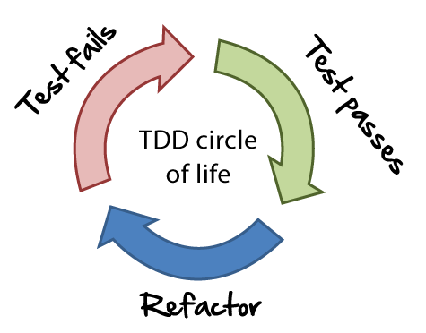
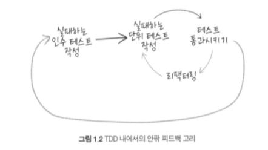

## 테스트주도 개발의 핵심은 무엇인가?

### 1.1 학습 과정으로서의 소프트웨어개발
- 거의 모든 소프트웨어 프로젝트에서 전에 경험하지 못했던 뭔가를 시도한다.
- 개발자들은 자신이 사용 중인 기술을 완전히 이해하지 못할때가 많다.
- 소프트웨어 프로젝트에 관련된 모든 이들은 프로젝트가 진행되면서 배워야한다.
- 사람들은 프로젝트에 변화가 있으리라는 사실을 모두 알고 있지만 뭐가 변할지 모른다.
- 불확실한 변화를 예측하려면 경험이 늘어남에 따라 불확실성을 해결하는 데 도움이 될 프로세스가 필요하다.

### 1.2 피드백은 가장 기본적인 도구다
- 이미 완료한 작업의 양과 질에 관한 피드백을 받는다.
- 완료된 작업을 각 주기마다 배포하는 일은 아주 중요하다.
- 배포하지 않고는 피드백이 완전해지지 않는다.
- 반복적인 개발을 계속해서 충분한 상태에 이를 때까지 피드백에 응답해 기능 구현을 다듬는다.

### 1.3 변화를 돕는 실천법
- 비용을 줄이려면 테스트를 자동화해야한다.
- 코드를 가능한 한 단순하게 유지해야한다.
- 코드를 작성하기 전에 테스트를 작성한다.
(TDD는 작업을 완료한 후 작업 결과를 검증하려고 테스트를 작성하는 것이 아니라 설계 활동으로 전환시킴)

### 1.4 테스트 주도 개발 간단 정리

TDD를 통해 시스템 구현(“시스템이 동작하는가?”)과 설계(“시스템이 잘 구조화돼 있는가?”)의 품질에 관한 피드백을 얻음.
1) 테스트 주도 개발의 황금률
    - 실패하는 테스트 없이는 새 기능을 작성하지 말라

### 1.5 좀 더 큰 그림

어떤 기능을 구현할 때 인수테스트를 작성하는 것으로 시작한다. 여기서 인수테스트란 만들고자 하는 기능을 시험하는 테스트를 말함. 인수테스트 하에서는 단위 테스트 수준의 테스트, 구현, 리팩터링 주기를 따라 기능을 개발. 전체 주기는 위 그림과 같음.
(인수 테스트란 만들고자 하는 기능을 시험하는 테스트를 말한다.)
단위 테스트만 있는 프로젝트는 TDD 프로세스가 주는 아주 중요한 혜택을 놓치고 있는 셈.

### 1.6 전구간 테스트
- 인수 테스트에서는 시스템 내부 코드를 가능한 한 직접 호출하지 말고 시스템 전 구간을 시험해야 한다.
- 전 구간 테스트(end-to-end test)는 외부에서 유입되는 시스템하고만 상호작용한다.
- 시스템과 해당 시스템을 구축하고 배포하는 프로세스를 모두 시험하는 방식을 의미

### 1.7 테스트의 수준
- 인수 테스트: 전체 시스템이 동작하는가?
- 통합 테스트: 변경할 수 없는 코드를 대상으로 코드가 동작하는가?
- 단위 테스트: 객체가 제대로 동작하는가? 객체를 이용하기가 편리한가?

### 1.8 외부 품질과 내부 품질
외부 품질은 시스템이 고객과 사용자의 요구를 얼마나 잘 충족하는가이며(기능, 신뢰성, 가용성, 응답성 등) 내부 품질은 시스템이 개발자와 관리자의 요구를 얼마나 잘 충족하는가이다(가독성, 유지보수 등)
- 외부 품질은 전 구간 테스트를 통해 얼마나 잘 충족되었는지 확인할 수 있다.
- 내부 품질은 단위 테스트를 통해 얼마나 잘 충족되었는지 확인할 수 있다.
(코드는 느슨하게 결합돼야하고 응집력이 높아야 한다.)