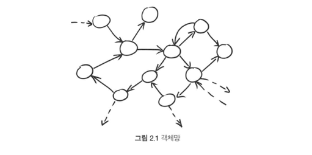

## 객체를 활용한 테스트 주도 개발

### 2.1 객체망

객체 지향 설계는 객체 자체보다 객체 간의 의사소통에 더 집중.

1) 객체 지향 시스템은 협업하는 객체의 망으로 구성
2) 시스템의 행위는 객체의 조합을 통해 나타나는 특성
3) 객체 구성을 관리할 목적으로 작성하는 코드를 객체망의 행위에 대한 선언적 정의라 함

시스템을 이런식으로 구축하면 방법(how)이 아니라 목적(what)에 집중할 수 시스템의 행위를 변경하기 쉬움.

### 2.2 값과 객체
시스템을 설계할 때는 값(value)과 객체(object)를 구분하는 것이 중요하다. 여기서 값은 변하지 않는 양이나 크기를 나타내며, 객체는 식별자와 상태, 처리과정을 지닌 인스턴스를 나타낸다.

### 2.3 메시지를 따르라
다른 객체와 쉽게 관계를 맺을 수 있게 객체를 설계하기만 한다면 고수준의 선언적 접근법이 주는 혜택을 누릴 수 있음. 이는 객체가 일반적인 의사소통 패턴을 따르고 객체 간의 의존성이 명시적임을 의미함.

- 도메인 모델은 의사소통 패턴에 속함 (도메인 모델은 행위와 데이터를 둘 다 아우르는 개념 모델이다)
- 의사소통 패턴은 객체 간에 있을 법한 관계에 의미를 부여
- 의사소통 구조는 객체라는 것을 처음 접할 때 배운 정적인 분류에서 개념적으로 굉장히 발전한 단계

### 2.4 묻지 말고 말하라
- 객체는 그것이 내부적으로 보유하고 있거나 메시지를 통해 확보한 정보만으로 의사 결정을 내려야 함.
- 객체는 다른 객체를 탐색해 뭔가를 일어나게 해서는 안됨.

이 스타일을 일관되게 따르면 코드가 좀 더 유연해짐. 객체를 손쉽게 교체할 수 있기 때문. 반면, 이 스타일을 따르지 않으면 '열차 전복' 코드가 만들어짐.

```java
(EditSaveCustomizer) master.getModelisable()
    .getDockablePanel()
    .getCustomizer()
    .getSaveItem.setEnabled(Boolean.FALSE.booleanValue());

// 위 코드는 다음과 같은 의미다
master.allowSavingOfCusomisations();
```
묻지 말고 답하라 (디미터의 법칙)를 따르면 객체 간의 상호 작용을 명시적으로 만들고 거기 이름을 부여 하게 됨. `master.allowSavingOfCusomisations()`는 코드의 목적을 훨씬 명확히 드러낸다.

### 2.5 그래도 가끔 물어라
값과 컬렉션으로부터 정보를 가져와 필터링하거나 팩터리를 이용해 새 객체를 생성할 때 가끔 '묻게 됨'.

```java
if (carriage.getSeates().getPercentReserved() < percentReservedBarrier) {
    // ...
}
```

위 코드처럼 Carriage의 내부 구조를 노출하고 스스로 답을 가늠하는 대신 아래와 같이 작성할 수 있음.

```java
if (carriage.hasSeatsAvailabledWithin(percentReservedBarrier)) {
    // ...
}
```

진정 답하고자 하는 질문을 던져 행위에 이해하기 쉬운 이름이 생김.

### 2.6 협력 객체의 단위 테스트
테스트 하려는 대상 객체의 이웃을 다른 대체물, 즉 목 객체(mock object)로 대체한다. 그렇게 하면 발생하는 이벤트에 대해 대상 객체가 가짜 이웃과 어떻게 상호 작용할지 지정할 수 있다. 이 같은 명세를 예상 구문(expectation)이라고 한다.


### 2.7 목 객체를 활용한 TDD 지원
목 객체를 활용한 테스트의 핵심 구조는 아래와 같다.

1) 필요한 목 객체 생성
2) 대상 객체를 포함한 실제 객체 생성
3) 대상 객체에서 목 객체가 어떻게 호출될지 예상하는 바를 기술
4) 대상 객체에서 유발(trigger) 메서드(하나 또는 여러 개)를 호출
5) 결과 값이 유효하고 예상되는 메서드 호출이 모두 일어났는지 확인