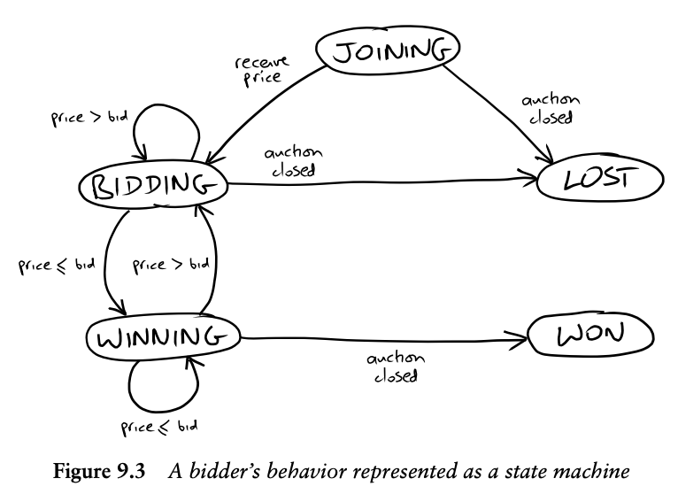

## 9장. 경매 스나이퍼 개발 의뢰

### 맨 처음부터 시작하기

###### 경매 스나이퍼: 마감시간이 임박했을 때 남보다 비싼 값을 불러 경매를 낙찰받는 행위.

입찰자가 보내는 Command
- Joining(경매 참여): 입찰자가 경매에 참여한다. 
- Bidding(입찰 진행): 입찰자가 경매에 입찰가를 보낸다.

경매에서 보내는 event
- Price(가격)): 현재 수락된 가격을 보고한다. 다음 입찰 때 높여야 할 최소 기준 가격과 현재 가격을 제시한 입찰자 이름이 포함돼 있다. 
- Close(경매 종료): 경매가 종료됐음을 알린다. 마지막 가격 이벤트를 제시한 입찰자가 해당 경매를 낙찰받는다.

#### "우선 동작하는 골격을 대상으로 테스트하라" 의 실천
할일 목록
- 단일품목: 경매참여, 입찰하지 못한 상태로 낙찰 실패
