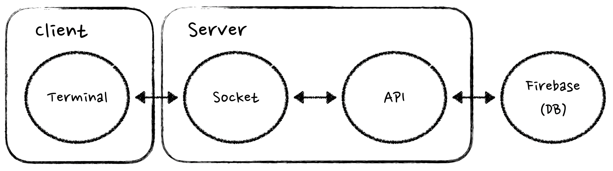
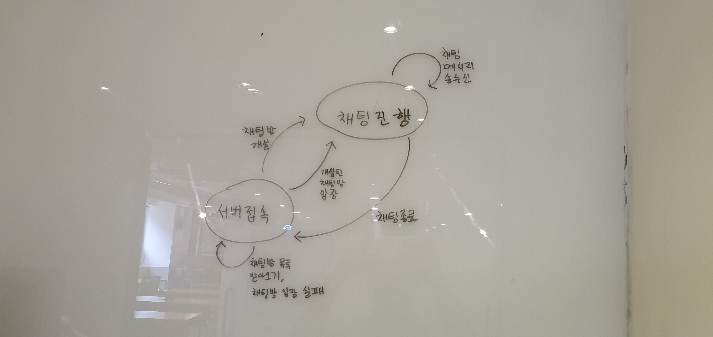

# 채팅 서비스
터미널 기반 실시간 채팅 서비스를 TDD 방법론을 활용하여 개발.
## 1. 요구사항
### 1.1. 필수
- 터미널을 통한 실시간 채팅 프로그램 (socket 방식)
- 텍스트 기반 채팅
- 채널(= 채팅방) 기반 그룹 채팅
- 채팅방 인원 최대 100명 제한
- 익명 채팅
- 채팅 로그 기룍

### 1.2. 옵션
- 파일 전송 기능
- 이미지 보기 기능

## 2. 개발환경
- JAVA
- Firebase
  - DB: firestore

## 3. 시스템 구성도

## 4. 시나리오(finite-state machine)

## 5. 할일목록
- 서버접속
- 채팅방 목록 받아오기
- 채팅방 개설
- 채팅방 입장
- 채팅방 입장 실패
- 채팅 메시지 송신
- 채팅 메시지 수신
- command 송신
- command 수신
- 채팅방 나가기
- 파일 전송
- 파일 수신
- 이미지 보기
